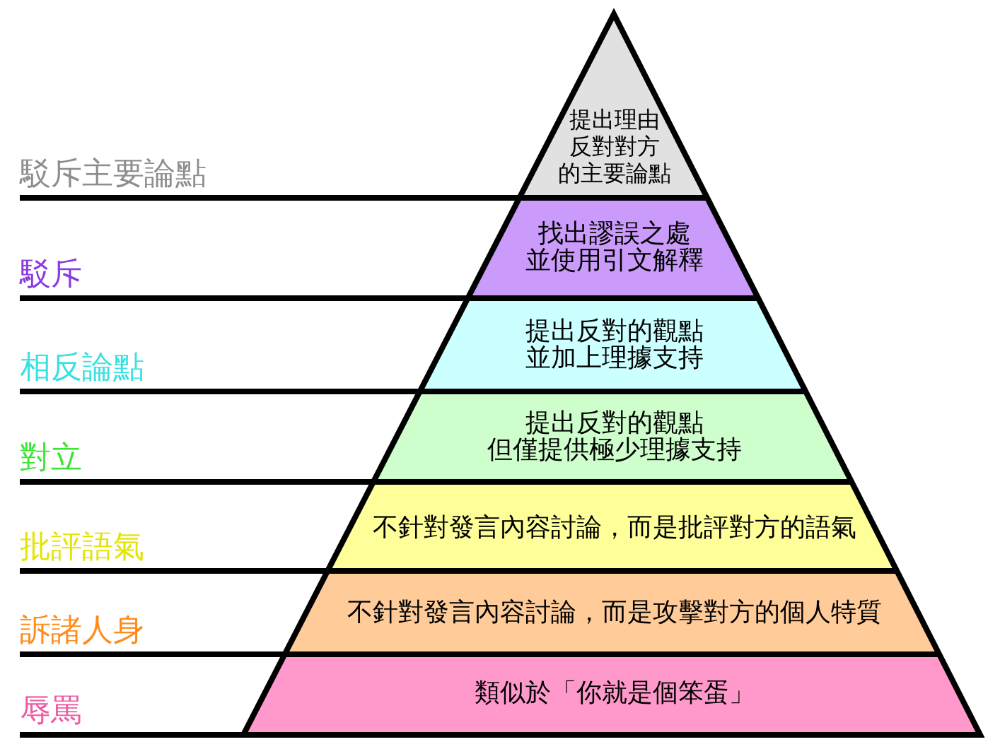

每当发现自己被别人拉黑的时候，实际上是有一点难过的。
无论自己是否多么赞同 or 不赞同对方的观点。
但自己在网上遇到不爽的内容和视频，第一时间也是拉黑为妙。
这样其实是一个很矛盾但又不矛盾的事情，实际上主观来说，
都想让自己的观点被别人认同，但本能的不想接受别人的非议。

> “人类的悲欢并不相通，我只觉得他们吵闹” ———— 鲁迅

人类是一种趋于安定的生物，正所谓懒惰是第一生产力。

懒得跟别人较劲？OK

## **拉黑**

而因为不接受别人的观点，而又有很多各种各样的行为

正如文章 [HOW TO DISAGREE（如何反驳）](http://www.paulgraham.com/disagree.html) 中，将反驳分成了七个层次

但在实际生活中，我们能见到无数的低质言论（以主观视角来看），去和他们一个个理论，显得浪费时间，事倍功半，有时候还会引火上身。

“他就是个**，别和他一般见识。”、“这种人，我直接就拉黑了。”……

从这个角度看，拉黑的确是个一劳永逸的事情。

## 但，然后呢？

很明显，拉黑会造成双方隔阂愈拉愈大。
甚至有时，一堵墙的出现，会让两面的人对着墙骂娘，
但本质上，唯一的好处就是爽了自己，然后脏了墙。最后增加的只有隔阂

当然，过滤低质言论的方法甚多，
例如等级制度（例如Bilbili）、增加发言难度（身份验证、用户邀请制度）

但实际上，人的精力是有限的，单纯的完整的输出自己的观点、想法，在当下互联网上已经是很难得的事情，还要解决不同的看法，更是难上加难。

越是这么想，越是发现人是多么孤独。

无力的孤独。

以上。
