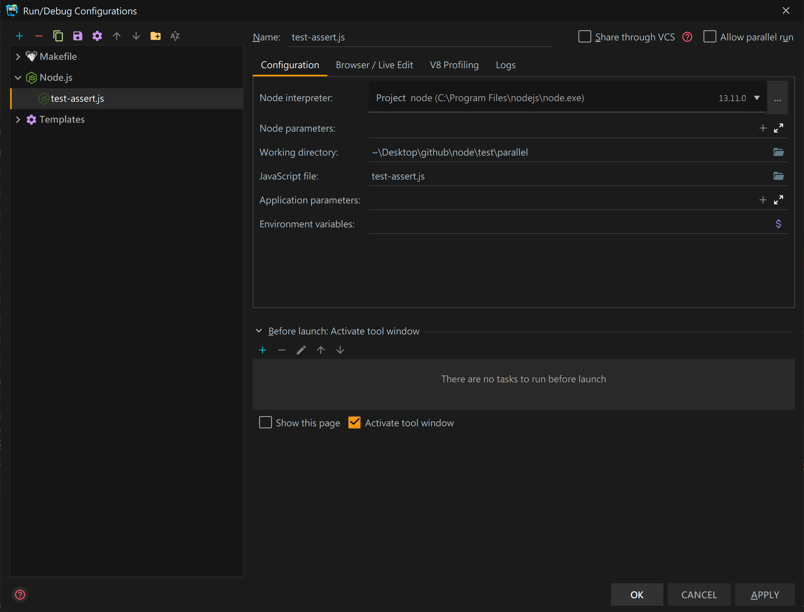
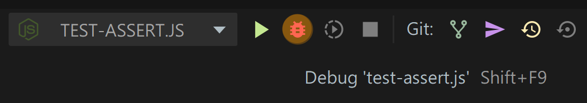
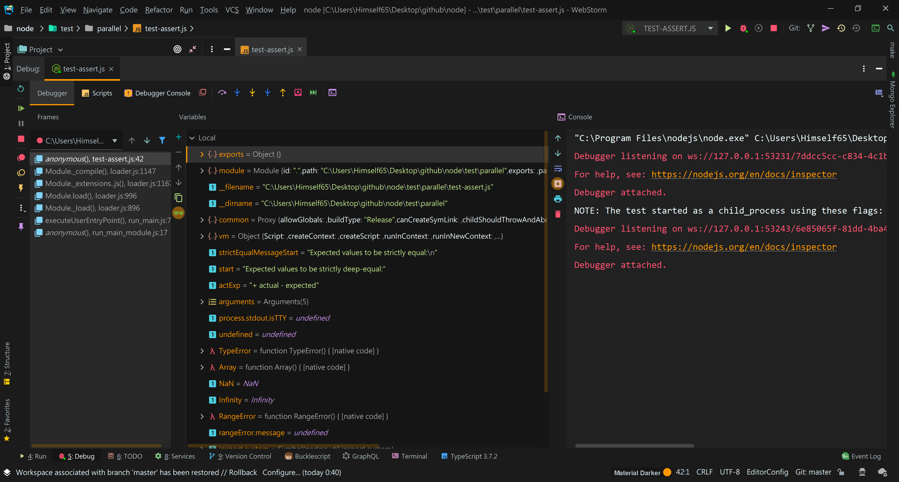
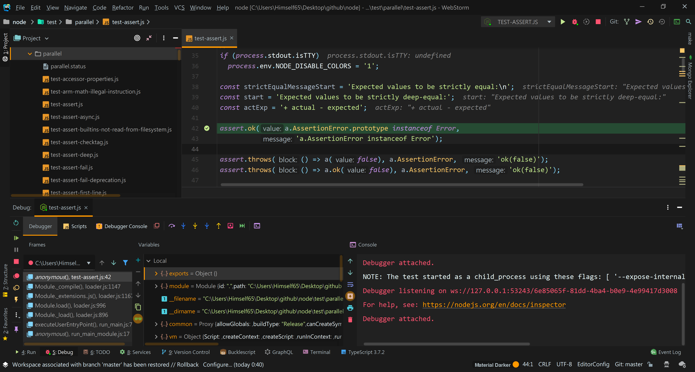
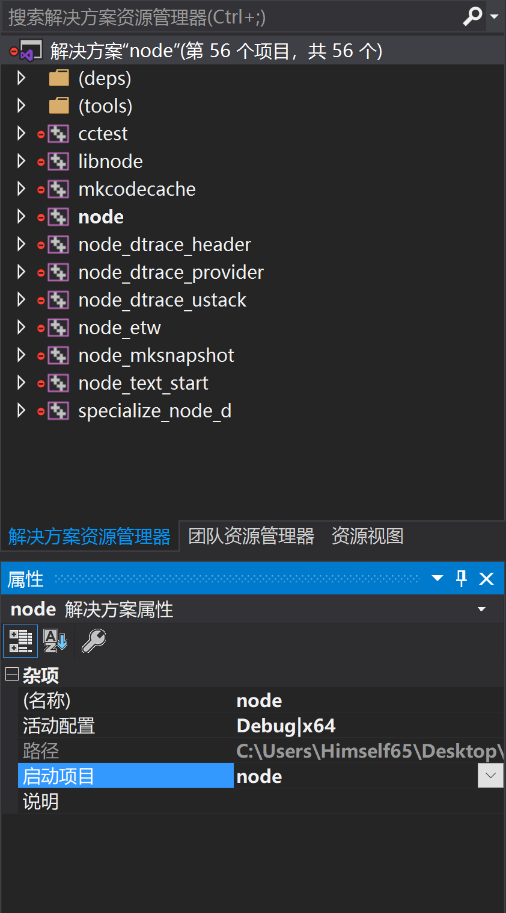
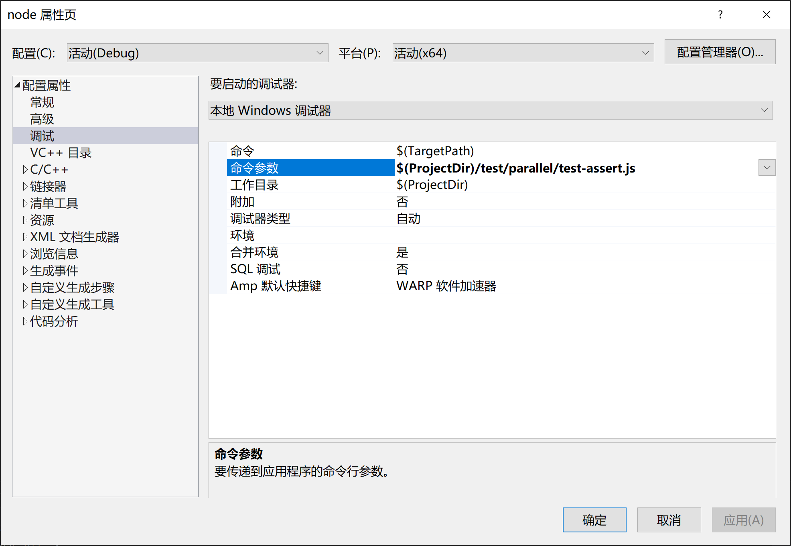
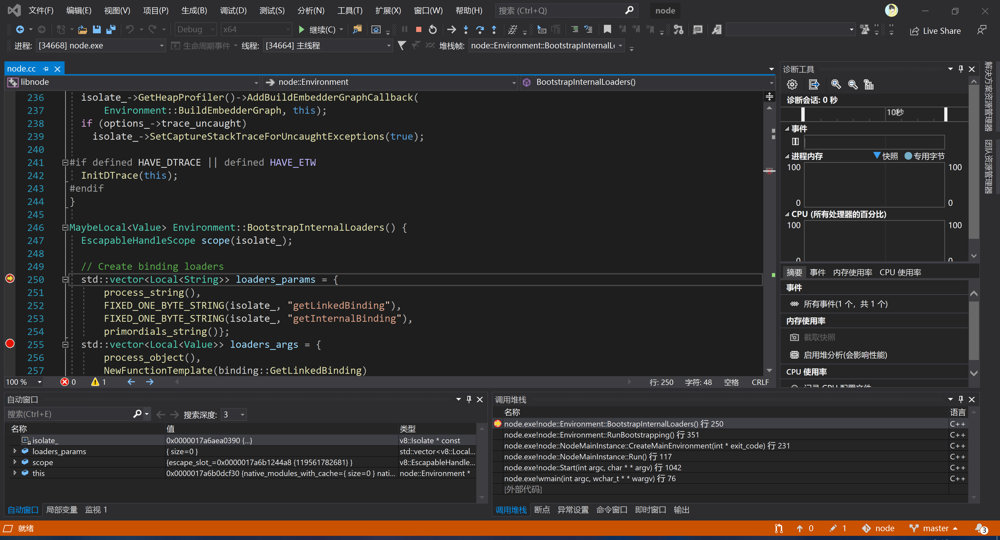
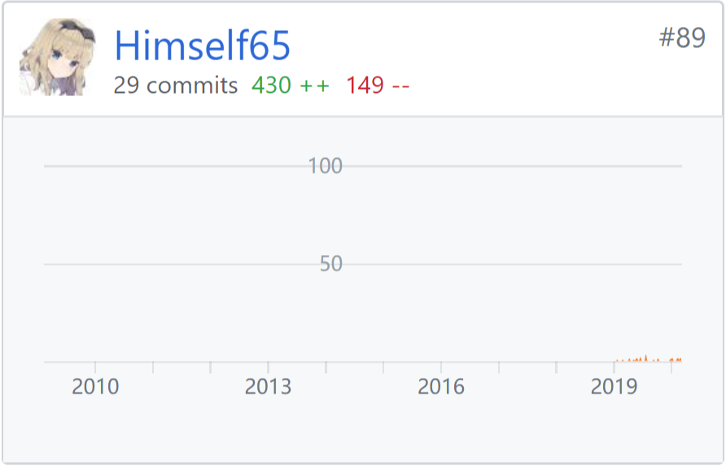

`Node.js` 作为一个世界级的项目，能为它贡献源代码当然是很开心的事情。

但如果，在给 `Node.js` 写了新代码后，不知道如何测试代码的正确性，
将会是非常头疼的事情。

本文会着重介绍 Debug `Node.js` 源代码，方便你为 `Node.js` 献一份力。

> 当然，此本文也适用于 `Node.js Application`

# 项目结构

主要基本分为：

- `src`:    `JavaScript` 部分
- `lib`:    `C++` 部分
- `deps`:   上游 `C++` 依赖
- `test`:   所有的测试代码
- `tools`:  测试工具链，主要是 `Python`（有`Python2`）

`Node.js` 官方也阐明了如何正确贡献新的代码，[运行测试](https://github.com/nodejs/node/blob/master/BUILDING.md#running-tests)、[提交PR](https://github.com/nodejs/node/blob/master/doc/guides/contributing/pull-requests.md)[......](https://github.com/nodejs/node/tree/master/doc/guides)

里面能找到正确的写法，但是，如果我们一个地方出错了，又该如何调试呢？

# 预先准备

[On Linux](https://github.com/nodejs/node/blob/master/BUILDING.md#building-nodejs-1)

```bash
./configure
make -j4
```

[On Windows](https://github.com/nodejs/node/blob/master/BUILDING.md#windows)

```
vcbuild.bat
# 或者
vcbuild.bat vs2019
```


# 调试 `JavaScript` 部分

## Node.js Inspector

[Debugging Guide](https://nodejs.org/en/docs/guides/debugging-getting-started/) 里已经说的非常清楚了，该文可以说是能调试任何 `Node.js` 的 **`js`** 代码

笔者推荐用 `WebStorm` 的调试功能，UI化的配置，比其他方法都要舒服的多






> BTW，如果你要测试 `*.mjs` 的 `ES Module` 部分，你得手动加上 `--inspect-brk`


# 调试 `C++` 代码

有些时候，你写的是 `C++` 代码，这时候用 `--inspect` 是无法断点到 `C++` 部分的。

## `Windows` 部分

这时候，我推荐使用 `CLion`，或者 Windows 下使用 `Visual Studio`。

### CLion

直接 `Add New Configuration` 然后添加 `makefile` 然后 `gdb` 调试 `C++` 代码。

笔者很少用 `Linux` 作 `node.js` 开发，这里就不再附图。

### Visual Studio 2019

我们首先生成项目

```bash
vcbuild.bat projgen nobuild # 仅生成 sln 项目
```

打开工作目录下生成的 `.sln` 文件即可

然后，`启动项目` 选择 `node`



直接运行的话，就相当于开启了 `node.js` 的 `REPL` 模式。

所以，我们在命令参数里面加入我们要测试的 `js` 文件和其他参数。



然后运行调试器，我们就可以看到被断点代码的上下文了



# 推荐阅读

[为 Node.js 贡献你的力量](https://zhuanlan.zhihu.com/p/27932211)
—— by Starkwang

[How to debug with WebStorm](https://blog.jetbrains.com/webstorm/2018/01/how-to-debug-with-webstorm/)
———— by Ekaterina Prigara

---

# 后言

笔者一年来的~~贡献~~水PR，终于到了 `Node.js` top 100 开发者，以后也会继续贡献开源社区。


