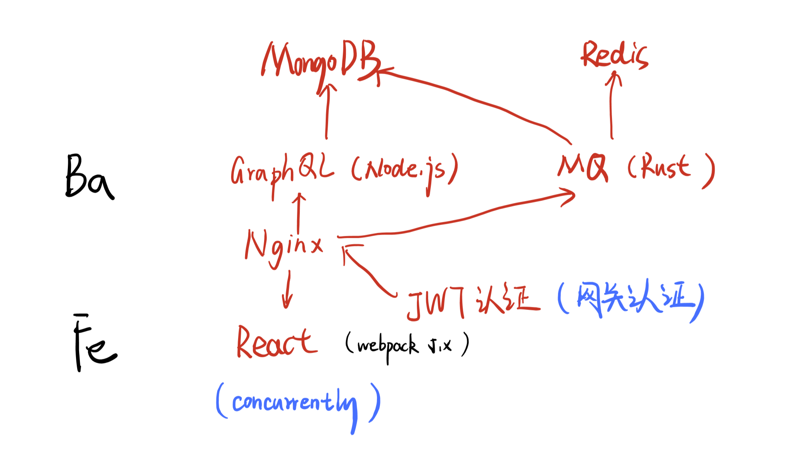

七月份去BiliBili总部面基 Wayslog 的时候，不下二次听说Rust。记得第一次是在世界一流大学（副级部）面基 Darkflames 和我谈Rust所有权。然后想着写点啥Rust代码玩玩，结果一直咕到了9102年年末。

## 正文

既然是玩具项目，干脆什么也玩具起来，所以我大致设计了一下全端的基本架构



MQ部分现阶段大概就写了基本框架，Rust不是很熟

就写了个简单的 `post`, `get`

```rust
#[post("/message")]
pub async fn add_message(
    redis_client: web::Data<redis::Client>,
    message: web::Json<Message>,
) -> impl Responder {
    let id = message.id.clone();
    let json_string = serde_json::to_string(&message.into_inner()).unwrap();
    debug!("{}", json_string.clone());
    let connection = &mut redis_client.get_connection().unwrap();
    let _: () = redis::cmd("SET")
        .arg(id)
        .arg(json_string)
        .query(connection)
        .unwrap();

    HttpResponse::Ok()
}

#[derive(Deserialize)]
struct MessageQuery {
    pub id: i32
}

#[get("/message")]
pub async fn get_message(
    redis_client: web::Data<redis::Client>,
    query: web::Query<MessageQuery>,
) -> impl Responder {
    let connection = &mut redis_client.get_connection().unwrap();
    let res: RedisResult<String> = redis::cmd("GET")
        .arg(query.id.to_string())
        .query(connection);
    if res.is_ok() {
        let json = res.unwrap();
        debug!("{}", json);
        HttpResponse::Ok()
            .content_type("application/json")
            .body(json)
    } else {
        HttpResponse::NotFound().finish()
    }
}
```

以后开发的思路和遇到的问题都会写成Blog，顺便分享点东西
