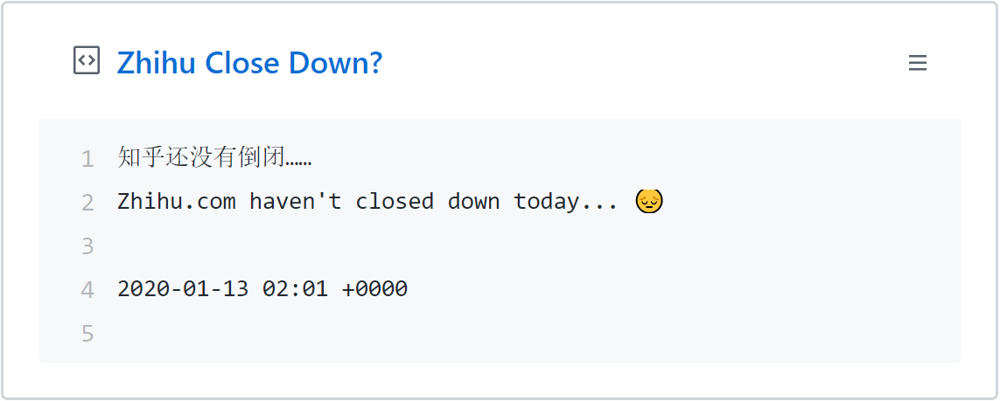

`GitHub Actions` 虽然还有许多诸多不便，我光是昨晚就找出俩不好用的地方：

- [Turn off the old GitHub Acitions when the latest one comes on Pull Request](https://github.com/nodejs/node/issues/31329)
- [Path filtering for jobs and steps](https://github.community/t5/GitHub-Actions/Path-filtering-for-jobs-and-steps/td-p/33617)

但如果不太细究，写起来还算方便。比如我花了不到二十分钟就写完了这个判断脚本。

直接每三十分钟运行一次脚本，随后更新 `GitHub Gist`，不再过多赘述，看代码自然懂。（[源地址](https://github.com/Himself65/did-zhihu-close-down-today)）

```yml
name: Check if Zhihu.com has closed down

on:
  schedule:
    - cron: "*/30 * * * *"
  push:
    branches:
      - master

jobs:
  checker:
    runs-on: ubuntu-latest
    steps:
      - uses: actions/checkout@v1
      - name: Use Node.js 12.x
        uses: actions/setup-node@v1
        with:
          node-version: '12.x'
      - name: Cache NPM dependencies
        uses: actions/cache@v1
        with:
          path: node_modules
          key: ${{ runner.OS }}-npm-cache
          restore-keys: |
            ${{ runner.OS }}-npm-cache
      - name: Install Dependencies
        run: |
          npm install -g yarn
          yarn --frozen-lockfile --non-interactive
      - name: Run Script
        run: |
          node index.js
        env:
          GH_PAT: ${{ secrets.GH_PAT }}
          GH_USERNAME: himself65
          GIST_ID: 45b82f824f6185b29555a6da516b7337
```

```js
require('dotenv').config()

const axios = require('axios')
const moment = require('moment')
const { Toolkit } = require('actions-toolkit')
const { GistBox } = require('gist-box')

Toolkit.run(
  async tools => {
    const { GIST_ID, GH_USERNAME, GH_PAT } = process.env

    // Get the user's public events
    tools.log.debug(`Getting activity for ${GH_USERNAME}`)

    let closed = true
    for (let i = 0; i < 3; i++) {
      await axios.get('https://www.zhihu.com').then(res => {
        if (res.status === 200) {
          closed = false
        }
      })
    }

    const time = moment().format('YYYY-MM-DD kk:mm ZZ')

    let content = ''
    if (closed) {
      content = `知乎真的倒闭了！！！
Zhihu.com have closed down today!!!😊
${time}
      `
    } else {
      content = `知乎还没有倒闭……
Zhihu.com haven't closed down today... 😔
${time}
      `
    }

    const box = new GistBox({ id: GIST_ID, token: GH_PAT })
    try {
      tools.log.debug(`Updating Gist ${GIST_ID}`)
      await box.update({ content })
      tools.exit.success('Gist updated!')
    } catch (err) {
      tools.log.debug('Error getting or update the Gist:')
      return tools.exit.failure(err)
    }
  },
  {
    event: ['schedule', 'push'],
    secrets: ['GH_PAT', 'GH_USERNAME', 'GIST_ID']
  }
)
```

