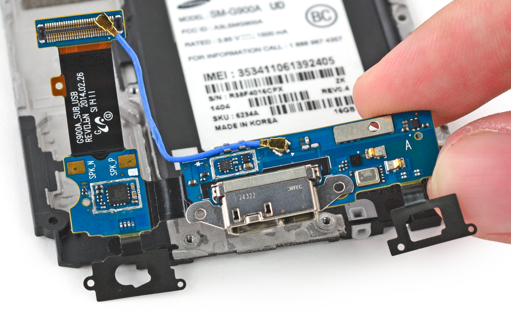

# 十年中，我的电子产品变化

> [知乎问题：这十年你携带的电子产品发生了哪些变化？](https://www.zhihu.com/question/347363750)

## 正文

至少半年前，我手头没有一台心仪的电子设备的

手机一开始是Samsung S6500（2013年左右），看高清视频基本闪退，屏幕还小，让我很难受。

两年后，母亲送了我当时刚出不久的Samsung Galaxy S5（下文称之为S5），这是让我喜忧参半的手机，大概从2016年到2017年中，我从这台机子中学会了如何**正确的**使用互联网，如何**正确的**使用Android（获取Root、刷第三方ROM、破解免流），也在我早年的互联网中认识了各种人（比如瘟疫公司吧前吧主[法伦斯泰尔](https://www.zhihu.com/people/GiacomoChina)、Line上的一位台湾朋友郭Jason，或者QZone上的白玖渊等），可以说那台S5对我个人来说意义非凡。

---

## 后记

但S5也不乏诸多客观缺点，比如很奇葩的充电口搭配、充电口防水塞很容易断掉导致防水功能基本失灵（本人使用一年后断掉了），最重要的是它非常烫，我用过的这么多手机中，没有像它甚至没有带任何保护套，正常使用都十分烫手的手机。最后，因为防水功能失效，充电口进水时充电导致充电部分膨胀最后彻底无法使用。

然后，我开始了Apple生态的体验，我母亲将她的iPhone5S给了我，iOS也不能像Android一样做我曾经做的事情，于是手机回归手机本质，看看视频，聊聊天，刷刷知乎（这时我已经脱离百度贴吧，开始使用知乎），顺带着之前买的MacBook Air，我也知道AirDrop和iCloud等生态是多么方便。当然，在买这台MBA之前，曾经在电脑城买的应该是联想扬天B4308A-IFI（不太确定），总之被坑的很惨。

当然MacBook Air性能不足，仅仅是某些小方面体验很好。我一直拿着它学习完了C、Objective-C、C++等语言，然后入门了iOS开发，当时正巧Swift 1.0、2.0、3.0不断整breaking changes，最后因为MBA跑 `XCode` 后劲不足，我就放弃了iOS开发。

大约是前年，我花重金买了Surface Pro 5（i7 + 16GB + 512GB），买之前我认为它会很爽，买后我也成为Surface劝退师（参考[这篇文章](https://www.zhihu.com/question/314592750/answer/825888702)）

一直到最近有了自己的工资，然后买了一些自己喜欢的电子产品，
比如iPhoneXR替换了之前的iPhoneSE，让我脱离了小屏市场，我也再也不习惯小屏幕的大小；联想Y9000X（i9版）替换了之前的Surface Pro 5，让我写代码再也没有不爽，边编译边看番再也不卡顿；Nintendo Switch、PlayStation 4，替换了我的Steam，玩了一遍我很多年前就想玩的喷射战士、荒野大镖客、暴雨、尼尔机械纪元；AirPods Pro、WH-1000XM3代替了每次买手机附赠的耳机，让我真正的享受安静的音乐；Apple Watch Series 3（5） 替换了我曾经的iPod shuffle，给了我一个提醒工具、健康管理工具。

我十年的电子产品，大概就是这样。

以上。
